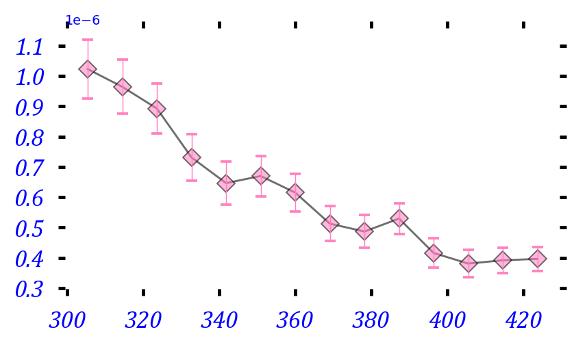
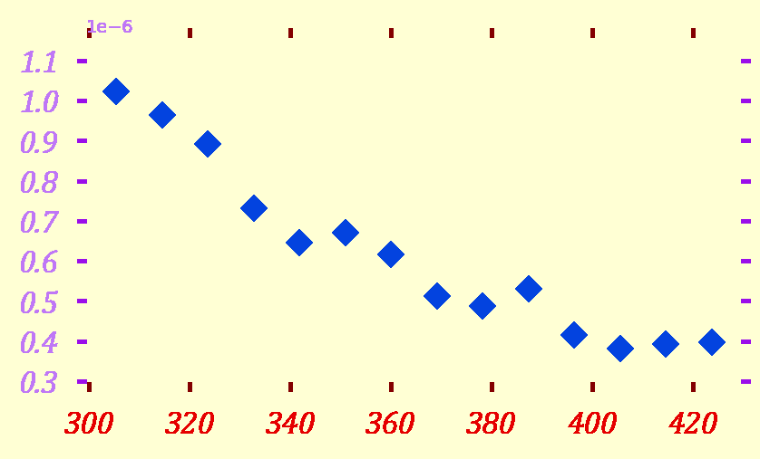
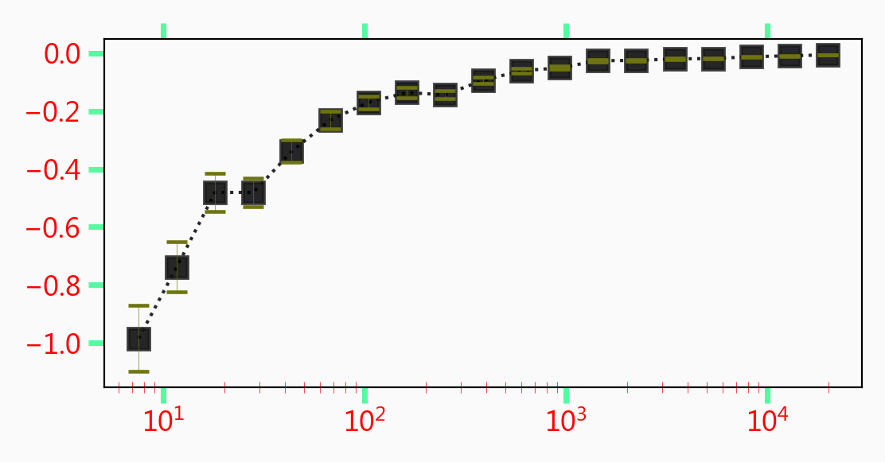
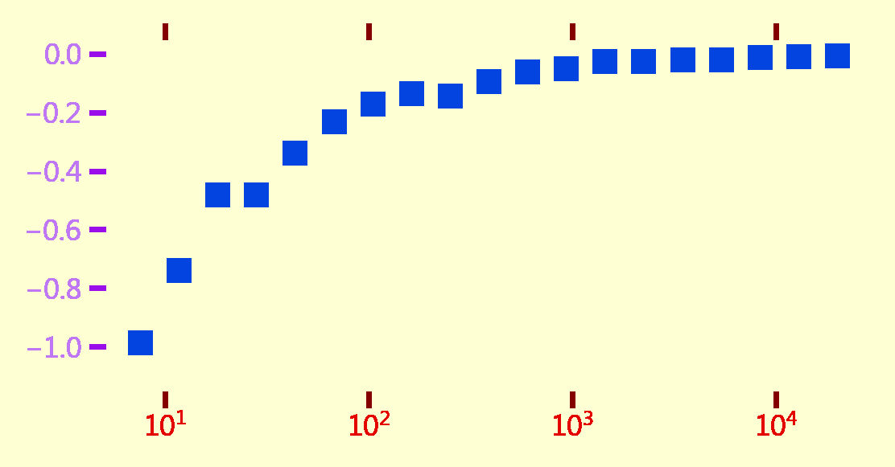
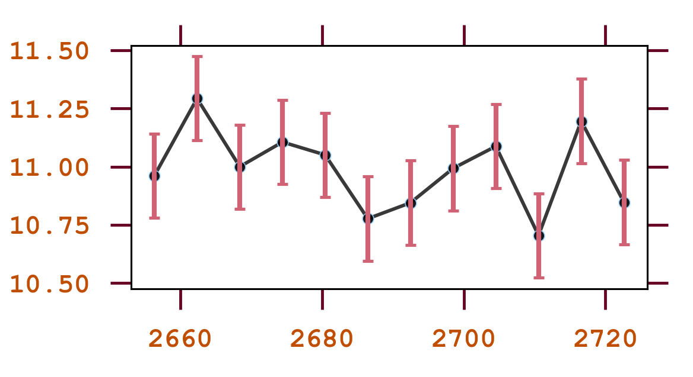
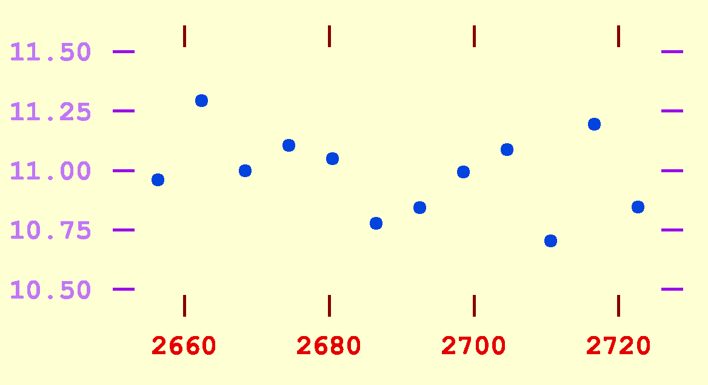

# Fairplay
 Fairplay is a library built with the goal of enabling fully automated extraction of data from plots. One of the primary components is a plot simulator which can be used to generate training images for various tasks.

## Installation
Clone the repository. Then, from within `fairplay/`:
```
pip install -e ./
```
Dependencies will be installed automatically.
Python >= 3.9 recommended.

## Usage
```
python ./src/fairplay/gen/generate_random_scatter.py ./data/demo -n 20 -t 10
```
**Arguments**
- `./data/demo`: directory to build image dataset and corresponding labeled images
- `-n 20`: 20 training images
- `-t 10`: 10 test images

## Example Output

RGB values for class labels (e.g. x ticks, markers, background) are defined as `label_colors` in `generate_random_scatter.py`

| Simulated             |  Labeled |
:-------------------------:|:-------------------------:
 | 
 |  
 |  


